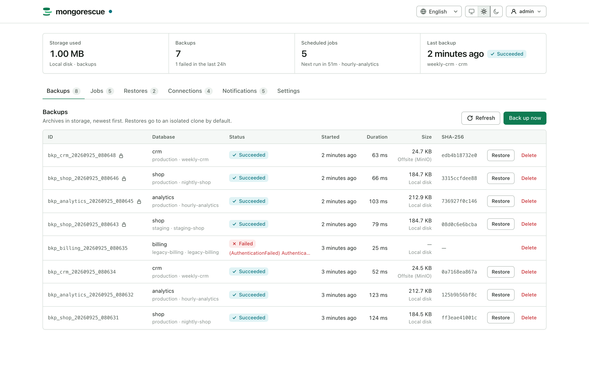
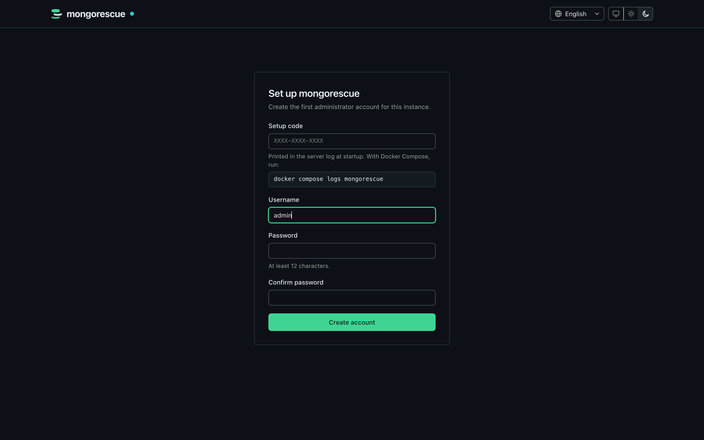
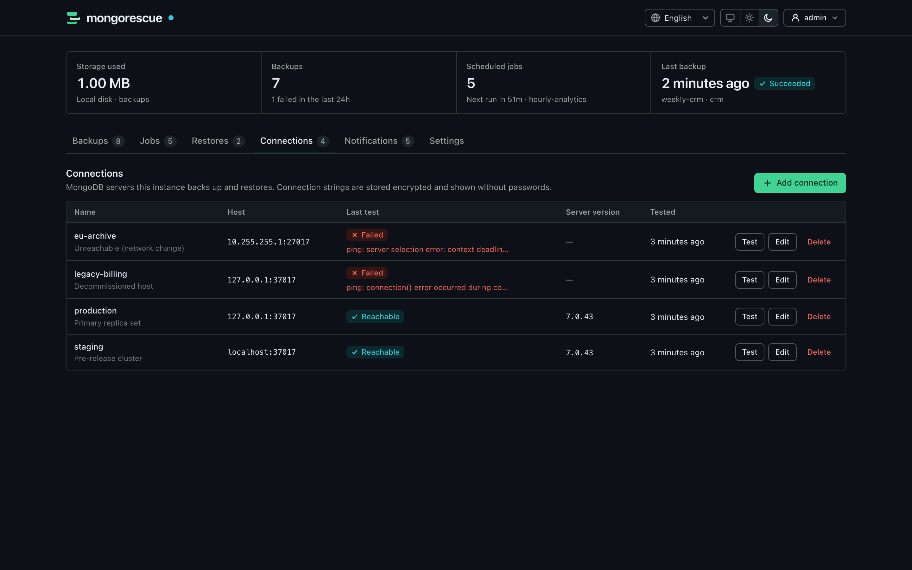
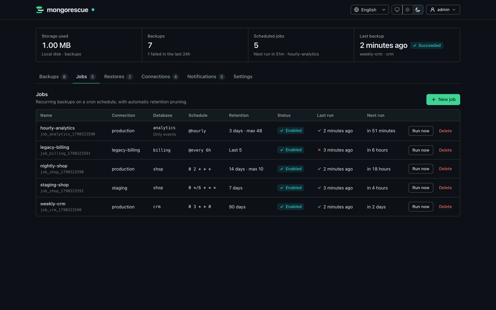
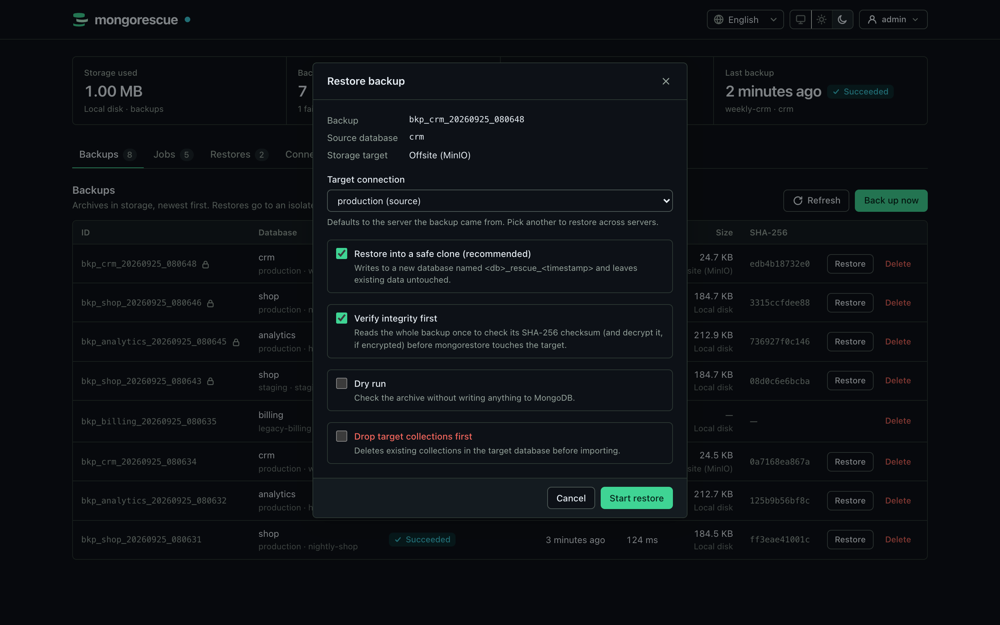
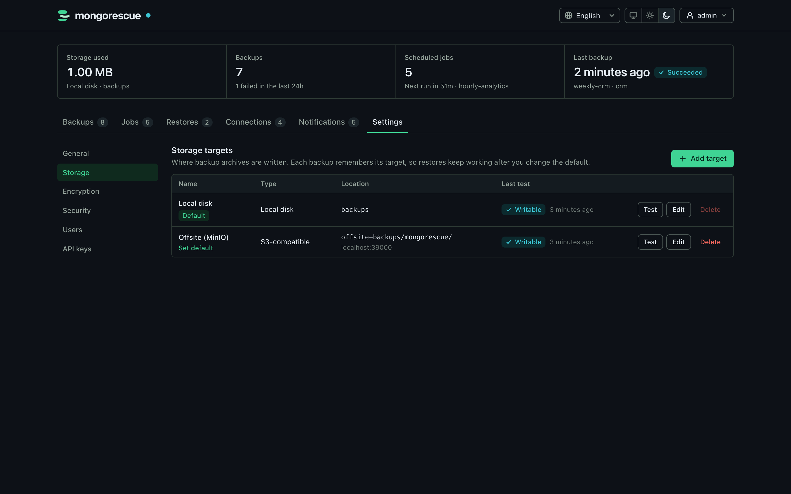
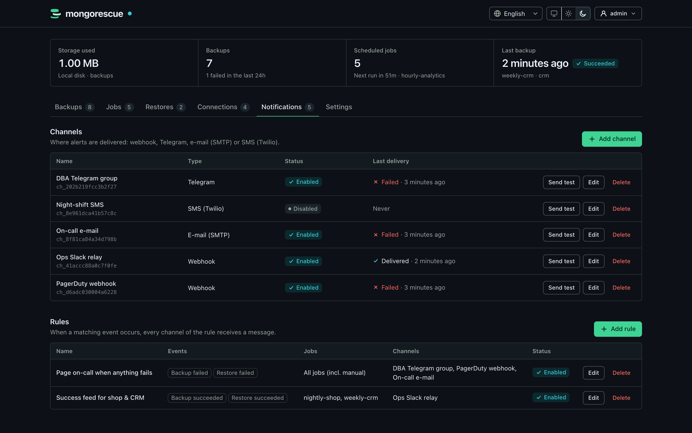
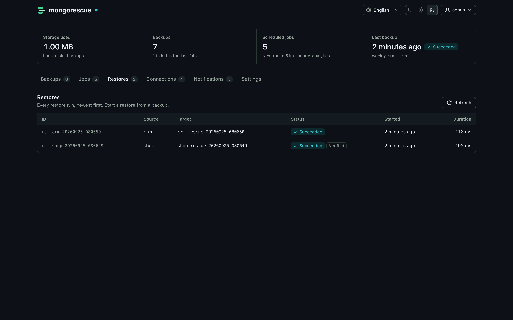
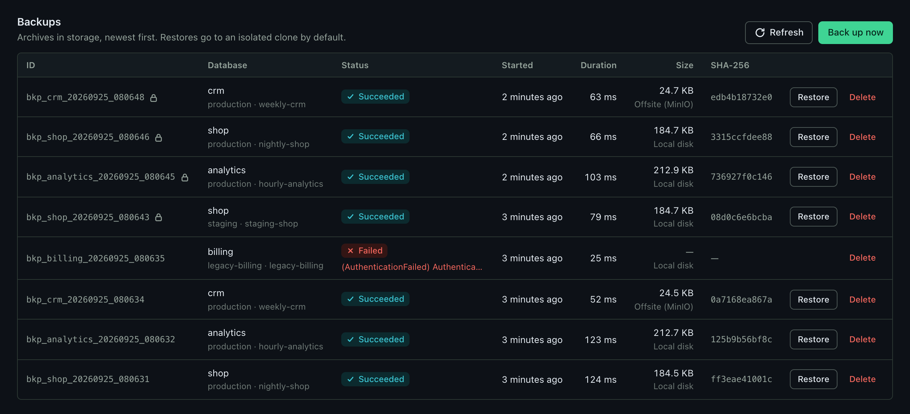
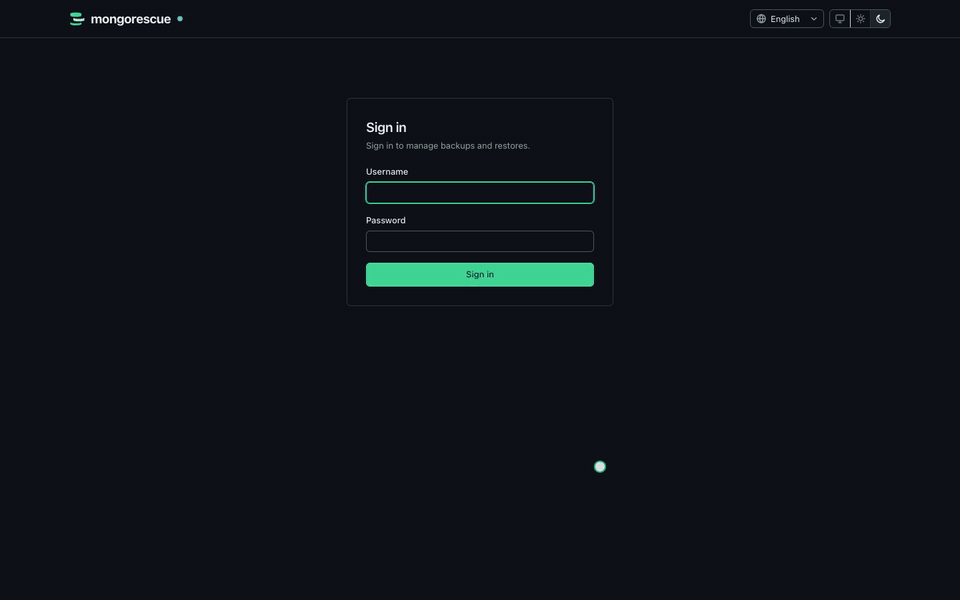

<p align="center">
  
</p>

<p align="center">
  MongoDB backups and restores that stream, verify and encrypt.<br>
  A single Go binary with a built-in dashboard.
</p>

<p align="center">
  <a href="https://github.com/YigitCittan/mongorescue/actions/workflows/ci.yml"></a>
  <a href="https://github.com/YigitCittan/mongorescue/releases"></a>
  <a href="LICENSE"></a>
  <a href="https://scorecard.dev/viewer/?uri=github.com/YigitCittan/mongorescue"></a>
</p>

<picture>
  <source media="(prefers-color-scheme: dark)" srcset="docs/assets/screenshots/dashboard-dark.png">
  
</picture>

<details>
<summary>More screenshots</summary>

| | |
| --- | --- |
|  |  |
| First-run setup | MongoDB connections |
|  |  |
| Scheduled jobs | Restore into a safe clone |
|  |  |
| Storage targets | Notifications |
|  |  |
| Restore history | Backups |

</details>

MongoRescue runs `mongodump` on a schedule, streams the archive to local disk or any S3-compatible bucket, and brings it back with `mongorestore` when you need it. The dump is piped straight through, so memory use stays flat no matter how large the database is.

Restores go into a separate copy of the database (`<db>_rescue_<timestamp>`) unless you explicitly ask to overwrite the original. Nothing touches production by accident.

## Features

- Manage many MongoDB servers from one instance: connections are tested, their databases and collections listed, and backups can be restored into another server
- Scheduled and on-demand backups with retention by age or count
- Several storage targets, managed in the dashboard: local disk and S3-compatible buckets (AWS S3, MinIO, Cloudflare R2, Backblaze B2, DigitalOcean Spaces, Wasabi); every backup remembers its target
- Safe-clone restores by default; in-place restores require explicit confirmation and are checksum-verified first
- Optional [age](https://age-encryption.org) encryption, so the bucket only ever stores ciphertext
- Notifications on success or failure via webhook, Telegram, email or SMS, with simple routing rules
- Prometheus metrics, including the time of the last successful backup per job
- User accounts with sessions and CSRF protection, API keys for automation, and a first-run setup with a one-time code
- Connection strings and notification secrets are encrypted at rest, never logged and never returned by the API
- One static binary for Linux, macOS and Windows, plus a multi-arch container image

## Quick start

```bash
docker run -d --name mongorescue -p 8080:8080 \
  -v mongorescue-data:/data -v mongorescue-backups:/backups \
  ghcr.io/yigitcittan/mongorescue:latest
```

Or, with Docker Compose, run `docker compose up -d` in a clone of this repository (or next to a downloaded [docker-compose.yml](docker-compose.yml)).

1. Open http://localhost:8080.
2. Enter the one-time setup code printed in the logs (`docker logs mongorescue` or `docker compose logs mongorescue`) and create the admin account.
3. Add a MongoDB connection, test it, and create your first backup job.

The image includes the [MongoDB Database Tools](https://www.mongodb.com/docs/database-tools/). To run the binary instead, download it from [Releases](https://github.com/YigitCittan/mongorescue/releases), put `mongodump` and `mongorestore` (100.3.0 or newer) on your `PATH`, and run `./mongorescue`.

MongoRescue serves plain HTTP. Before you expose the port to a network, put a TLS-terminating reverse proxy in front of it; see [docs/production.md](docs/production.md). No MongoDB to try it with? [examples/with-mongodb.yml](examples/with-mongodb.yml) adds a demo instance to the Compose setup.

<p align="center">
  
</p>

## Using the API

Everything the dashboard does is available over HTTP. In the dashboard, open **Settings → API keys**, create a key and copy it (it is shown only once). Then use it as a bearer token, for example to back up a database on one of your connections:

```bash
KEY='mr_...'   # the key you just created

curl -X POST http://localhost:8080/api/v1/backups \
  -H "Authorization: Bearer $KEY" \
  -d '{"connection_id": "conn_1a2b3c4d5e6f7a8b", "database": "shop"}'
```

Restore it into a safe clone on the same server, or pass `"target_connection_id"` to restore it into another one:

```bash
curl -X POST http://localhost:8080/api/v1/restore \
  -H "Authorization: Bearer $KEY" \
  -d '{"backup_id": "bkp_shop_20260924_030000_3f9a1c2e"}'
```

To restore over the original database, send `"safe_clone": false` together with `"confirm_in_place": true`. The full endpoint list is in [docs/api.md](docs/api.md).

## Configuration

Everything is configured in the dashboard. Storage targets (local directories and S3-compatible buckets), backup encryption, security options and limits live under **Settings**, next to users and API keys; MongoDB connections, jobs and notifications have their own tabs. All of it is stored in the data volume (`/data`), together with the key that encrypts stored credentials; back that volume up. Changes apply immediately, without a restart. Backups go to the **Local disk** target (the `/backups` volume) until you add another one.

Only a few bootstrap options are read at startup:

| Flag | Environment variable | Default |
| :--- | :--- | :--- |
| `-data-dir` | `MONGORESCUE_DATA_DIR` | `./data` (`/data` in the image) |
| `-host` / `-port` | `MONGORESCUE_SERVER_HOST` / `MONGORESCUE_SERVER_PORT` | `0.0.0.0` / `8080` |
| `-log-level` | | `info` |
| | `MONGORESCUE_SECRET_KEY` (optional) | generated `<data_dir>/secret.key` |

There is no configuration file. Environment variables of earlier builds are imported into the database once and then ignored; see [docs/configuration.md](docs/configuration.md) for every setting and the upgrade notes.

## Documentation

- [Configuration reference](docs/configuration.md)
- [REST API](docs/api.md)
- [Encryption and verified restores](docs/encryption.md)
- [Notifications](docs/notifications.md)
- [Metrics and alerting](docs/metrics.md)
- [Running in production](docs/production.md)
- [Architecture](docs/architecture.md)

## Development

You need Go 1.26 or newer.

```bash
make build        # build ./bin/mongorescue
make test-race    # unit tests
make test-integration-docker   # integration tests against MongoDB, MinIO and LocalStack in Docker
```

See [CONTRIBUTING.md](CONTRIBUTING.md) for the full testing setup and how to send a pull request.

## Known limitations

- It runs as a single instance. Jobs, history, users and settings live in an embedded SQLite database (`mongorescue.db`); the data directory is locked, so a second instance on the same directory refuses to start.
- Every user and API key is an administrator, including settings, storage targets and the test endpoints that connect to hosts named in the request. Roles and single sign-on are not implemented yet.
- Losing `secret.key` (or `MONGORESCUE_SECRET_KEY`) makes the stored connection strings, notification secrets, storage credentials and encryption keys unrecoverable: keep a copy, stored apart from database backups.
- The dashboard has no automated browser tests yet; the API behind it is covered by Go tests.
- Windows binaries are unit-tested in CI, but the integration tests (real MongoDB, S3 emulators) run on Linux only.
- The standalone binary needs the MongoDB Database Tools (`mongodump`, `mongorestore`) installed on the host. The Docker image already includes them.

## Roadmap

Planned for upcoming releases:

- Backup scope per server (all databases), per database or per collection, each schedulable separately
- Roles (viewer, operator, admin) and single sign-on (OIDC)
- Storage targets (local disk, S3-compatible buckets) and backup encryption managed in the dashboard
- Scheduled restore drills and point-in-time recovery from the oplog
- `backup` / `restore` / `list` CLI commands
- A shared metadata store for running several instances

Ideas and help are welcome in [issues](https://github.com/YigitCittan/mongorescue/issues).

## License

MIT. Security issues: please report them privately, as described in [SECURITY.md](SECURITY.md).
