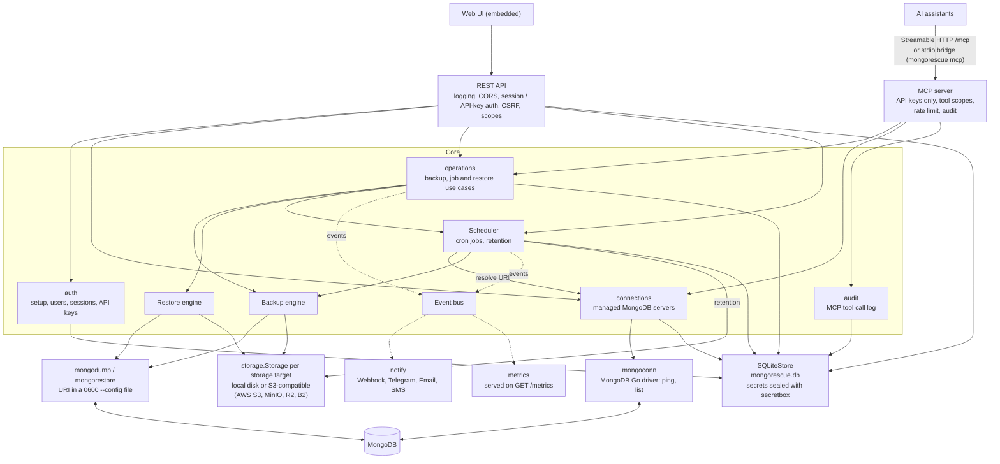
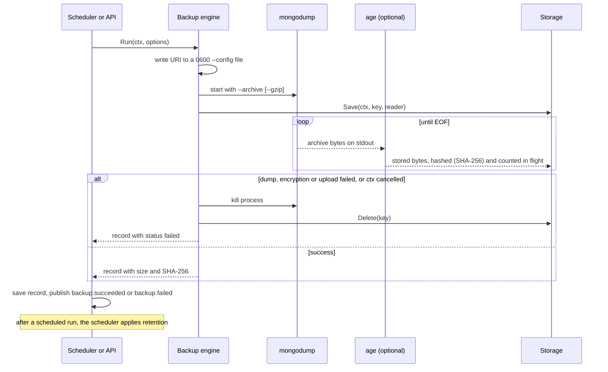
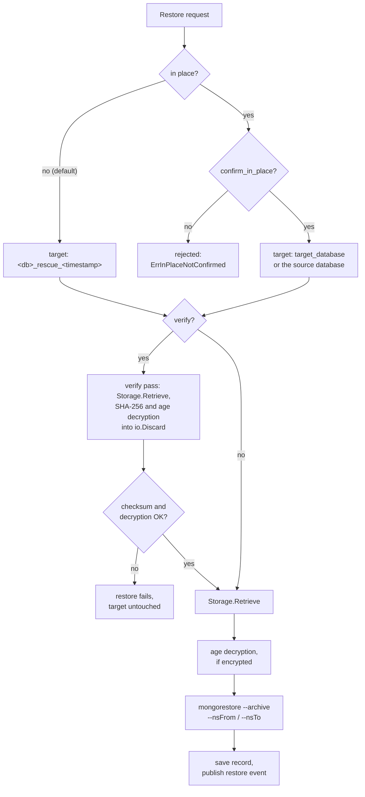

# Architecture

MongoRescue is a single Go binary that wraps the MongoDB Database Tools (`mongodump`, `mongorestore`) with scheduling, storage, encryption, notifications and a web dashboard. This page explains how the pieces fit together and why.



## Design principles

- **Hexagonal boundaries.** Business logic (`backup`, `restore`, `scheduler`, `notify`, `auth`, `connections`, `settings`, `targets`, `operations`, `audit`) does not know about HTTP, CLI flags or cloud SDKs. It depends on small interfaces (ports) such as `storage.Storage`, `auth.Repository`, `connections.Repository`, `connections.Prober`, `settings.Repository`, `targets.Repository`, `targets.Factory` and `audit.Repository`; `server`, `mcp` and `cmd/mongorescue` are delivery adapters, `storage`, `store`, `mongoconn` and the tool runners are infrastructure adapters. Cookies and headers are handled in `server`; password, session, CSRF, throttling and scope rules live in `auth`. The REST API and the MCP server call the same `operations` service for backups, job runs and restores, so the two adapters cannot apply different rules.
- **Stream-first I/O.** Dumps can be hundreds of gigabytes. Data moves through `io.Reader`/`io.Writer` pipes from the tool process to storage and back; it is never read into a `[]byte` or staged as a full copy on disk. Memory use does not grow with dump size. (Passphrase decryption is the one fixed exception: scrypt key derivation costs about 256 MiB, once per operation.)
- **Explicit dependency injection.** No global singletons. Components receive their dependencies through constructors and functional options (`backup.WithEncryptor`, `restore.WithVerifyPolicy`, `server.WithMetricsHandler`), which keeps every engine testable with fakes.
- **Standard library first.** `net/http` `ServeMux` with method patterns, `log/slog`, `context`, `crypto`. Third-party modules are limited to the AWS SDK v2, `filippo.io/age`, `robfig/cron/v3`, the Prometheus client, `modernc.org/sqlite`, `golang.org/x/crypto/bcrypt` and the MongoDB Go driver. The driver is confined to the `internal/mongoconn` adapter (connection tests and database/collection discovery); CI fails if any other production package imports it. Dumps and restores always go through `mongodump` and `mongorestore`.
- **Single binary.** The dashboard (`web/static`) is embedded with `//go:embed`; builds use `CGO_ENABLED=0` and cross-compile to Linux, macOS and Windows.

## Package map

| Package | Responsibility |
| :--- | :--- |
| `cmd/mongorescue` | Entry point: bootstrap flags (`-data-dir`, `-host`, `-port`, `-log-level`, `-version`), logger setup, then hands off to `app`; `mongorescue mcp` runs the stdio MCP bridge instead |
| `internal/app` | Wires dependencies, starts the HTTP server and scheduler, coordinates graceful shutdown |
| `internal/config` | Bootstrap options (data directory, listen address, log level, secret key) and the reader for deprecated environment variables and `<data_dir>/config.json` (one-time import) |
| `internal/settings` | Dashboard-managed settings (general, security, encryption): validation, keep-secret rule, retired keys, the live snapshot engines and server read |
| `internal/targets` | Storage targets: validation, keep-secret updates, probe tests, default target, one cached driver per target |
| `internal/models` | Domain types: `Job`, `Connection`, `BackupRecord`, `RestoreRequest`, `RestoreRecord`, `VerifyPolicy`, ID validation |
| `internal/auth` | Setup mode and setup code, users (bcrypt), sessions with CSRF tokens, login throttling, API keys and their scopes (`read` < `operator` < `admin`) |
| `internal/operations` | Backup, job-run and restore use cases shared by the REST API and the MCP server: validation, safe-clone and in-place rules, background runs, records and events; read models (`Status`, `Stats`) |
| `internal/audit` | The audit log of MCP tool calls: argument redaction, pruning, listing |
| `internal/mcp` | MCP delivery adapter (official Go SDK): tools, resources and prompts, the scope/rate-limit/audit middleware, the Streamable HTTP handler and the stdio bridge |
| `internal/connections` | Managed MongoDB connections: validation, keep-secret updates, tests, database/collection discovery |
| `internal/mongoconn` | The only production user of the MongoDB Go driver: implements `connections.Prober` |
| `internal/secretbox` | AES-256-GCM encryption of credentials at rest and the secret key file |
| `internal/backup` | Backup engine: runs `mongodump`, hashes, optionally encrypts, streams to storage, cleans up on failure |
| `internal/restore` | Restore engine: safe-clone namespace mapping, verify-before-restore, decryption, runs `mongorestore` |
| `internal/scheduler` | Cron scheduling (`robfig/cron/v3`) and retention pruning after successful scheduled runs (on-demand runs never prune) |
| `internal/storage` | The `Storage` port and its drivers: local filesystem and S3-compatible (AWS SDK v2 multipart) |
| `internal/store` | Metadata persistence (jobs, history, users, sessions, API keys, connections, notification settings) in an embedded SQLite database; data directory lock |
| `internal/encryption` | Streaming age encryption and decryption (X25519 and scrypt), key generation, identity hygiene |
| `internal/events` | Domain events emitted when backups and restores finish, and the in-process event bus |
| `internal/notify` | Notification channels (webhook, Telegram, SMTP, Twilio), rules, and the asynchronous delivery dispatcher |
| `internal/metrics` | Prometheus metrics on a dedicated registry |
| `internal/server` | REST API, authentication, scope (route → scope table) and CORS middleware, the `/mcp` mount with its Origin and Host checks, embedded dashboard serving |
| `internal/redact` | Dependency-free helpers that scrub credentials from URIs and free text |
| `internal/mongouri` | Structural validation of MongoDB connection strings without the driver |
| `internal/mongotools` | Helpers shared by the tool runners, chiefly passing the URI through a private `--config` file |
| `internal/integration` | `integration`-tagged end-to-end tests against real tools, MongoDB and S3 providers |
| `web` | Embedded dashboard assets (HTML, JS, i18n) |

## Backup data flow



1. The engine writes the MongoDB URI to a short-lived `0600` YAML file and passes `--config=<file>` to `mongodump`, so credentials never appear in the process list. The file is removed afterwards, and stale ones are cleaned up at startup.
2. `mongodump` writes an archive to stdout. With encryption enabled, a goroutine copies it through the age writer into an `io.Pipe`.
3. The (possibly encrypted) stream is hashed and counted as it is read by `Storage.Save`. The recorded SHA-256 and size therefore describe the stored bytes.
4. Errors propagate in both directions: a failed upload stops the dump instead of blocking on a full pipe, and a failed dump fails the upload. On any failure or cancellation the partially written object is deleted, so no truncated artifact is ever recorded as a backup.
5. The backup record is saved to the store, a `backup.succeeded` or `backup.failed` event is published, and, after a scheduled (cron) run only, the scheduler applies retention; on-demand runs and manual backups never prune.

## Restore data flow



1. The target namespace is resolved: `<db>_rescue_<timestamp>` by default (an omitted `safe_clone` means true). An in-place restore into the source database or an explicit `target_database` requires `safe_clone: false` and `confirm_in_place: true`; otherwise the request is rejected with `ErrInPlaceNotConfirmed` (HTTP 400).
2. If the verify policy applies (`always`, or `auto` for in-place restores), the artifact is streamed once into `io.Discard` while its SHA-256 is compared with the record and, for encrypted backups, the age stream is fully authenticated. On any failure the restore stops before `mongorestore` starts.
3. The artifact is streamed again, decrypted if needed, into `mongorestore`'s stdin. Namespace rewriting (`--nsFrom`/`--nsTo`) implements safe clones; `--nsInclude` implements collection-level restores.
4. The restore record is saved and a `restore.succeeded` or `restore.failed` event is published.

## Settings and storage targets

Only bootstrap options (data directory, listen address, log level, optional secret key) come from flags or the environment. Everything else is dashboard-managed and lives in the database:

- **Settings** (`internal/settings`) are stored one row per key in the `settings` table, secrets sealed with secretbox. The service validates every change, persists only the keys that changed and swaps an in-memory snapshot, and rebuilds the age encryptor and decryptor (current plus retired keys). Engines, the scheduler, auth and the HTTP server read that snapshot for each operation or request (`backup.WithRunConfig`, `restore.WithRunConfig`, `auth.WithSessionPolicy`, `server.WithSettings`), so no restart is needed.
- **Storage targets** (`internal/targets`) are rows of `storage_targets`, exactly one of them the default. The service builds one driver per target through the `storage.NewForTarget` factory, caches it by target and version, and rebuilds it when the target changes. The backup engine writes to the target named in the backup options (the default when none), and every backup record stores its `storage_target_id`: restores, deletions and retention use that target, never the current default. The store refuses to delete a target a job or a completed or running backup still references.
- **One-time import.** At startup `internal/config` reads the deprecated environment variables and `<data_dir>/config.json`; `internal/app` imports each source once (settings without a stored value, a storage target when none exists, the old default connection and static API key), records it as imported and warns.

## Storage interface

Every storage target implements one small, mockable port (`internal/storage/storage.go`):

```go
type Storage interface {
    Save(ctx context.Context, key string, r io.Reader) (*models.StorageObject, error)
    Retrieve(ctx context.Context, key string) (io.ReadCloser, error)
    Delete(ctx context.Context, key string) error
    List(ctx context.Context, prefix string) ([]*models.StorageObject, error)
    Stat(ctx context.Context, key string) (*models.StorageObject, error)
}
```

`Save` must stream without buffering the whole input. The local driver validates every key against its root directory to prevent path traversal and writes through a temporary file that is renamed on success. The S3 driver uses the multipart uploader and sends integrity checksums only when required, which keeps it compatible with R2, B2 and MinIO. New drivers must pass the shared conformance suite in `internal/integration`.

## Events, notifications and metrics

When a backup or restore finishes, the scheduler or API server publishes a domain event to an in-process bus (`internal/events`). `Publish` never blocks: if the bus queue is full the event is dropped and counted in `mongorescue_events_dropped_total`. Two subscribers consume events:

- `internal/notify` matches events against rules and enqueues deliveries into its own bounded queue served by a fixed worker pool, with a 10 second per-attempt timeout and exponential-backoff retries.
- `internal/metrics` updates Prometheus counters, histograms and gauges.

Both are started and stopped by `internal/app` with the rest of the process, so no goroutine outlives shutdown.

## Metadata persistence

`internal/store` keeps jobs, backup and restore records, users, sessions, API keys, connections, storage targets, settings, and notification channels and rules in an embedded SQLite database, always `<data_dir>/mongorescue.db`. The driver, `modernc.org/sqlite`, is pure Go, so release binaries stay `CGO_ENABLED=0` and self-contained.

- **Schema.** One table per entity (`jobs`, `backups`, `restores`, `connections`, `notification_channels`, `notification_rules`) plus `users`, `sessions`, `api_keys` (with their `scope`), `settings` and `audit_log` (MCP tool calls, pruned to the newest 10,000) with plain columns (a session belongs to its user with `ON DELETE CASCADE`). Each row stores the complete record as JSON in `data`, which is what the store reads back, so model fields can be added without a migration. Columns used for filtering and ordering (ID, name, database, job ID, status, start time) are copies rewritten on every save and indexed; lists come back newest first (backups, restores) or by name (jobs, channels, rules).
- **Migrations.** Versioned SQL files in `internal/store/migrations` are embedded in the binary and applied at startup, each in its own transaction together with its `schema_migrations` row, so reopening an up-to-date database is a no-op. A database migrated by a newer release is refused rather than downgraded.
- **Transactions and concurrency.** Connections use WAL, `synchronous=NORMAL`, `foreign_keys=ON` and a 5 second `busy_timeout`, and write transactions take the lock at `BEGIN`. The pool holds a single connection, which serialises statements inside the process; multi-step operations (deleting a channel together with its references in rules, the legacy import) run in one transaction.
- **Files.** The database is created with mode `0600` before SQLite opens it, and the database, `-wal` and `-shm` files are forced to `0600` after opening, independently of the umask. `secure_delete` overwrites deleted content. An advisory lock on `mongorescue.lock` (flock / LockFileEx) keeps a second instance off the same data directory.
- **Secrets at rest.** Connection URIs, notification channel secrets (webhook URL, HMAC secret and header values, bot token, SMTP password, Twilio token), S3 secret keys of storage targets and the encryption identity, passphrase and retired keys in `settings` are always sealed with `internal/secretbox` before they are written (AES-256-GCM, random nonce, versioned `sb2:` prefix; the associated data binds each value to its table, record ID and field, so a ciphertext copied into another record or field does not open), and opened when read, so the domain packages only ever see plaintext. Reads refuse secret fields that are not sealed in the current format. A key check value in `settings` makes startup fail with `ErrSecretKeyMismatch` when the key is missing or wrong; only the secret fields are inspected to decide whether a database without one already holds encrypted values. Plaintext values and `sb1:` values (which were not bound to their location) left by earlier builds are re-sealed once, in the same transaction that records the `secrets_format = sb2` marker in `settings`; from then on a secret field holding plaintext or an `sb1:` value (for example one planted while the server was stopped) makes startup fail with `ErrUnsealedSecret`, naming the table, record and field. A generated `secret.key` is fsynced together with its directory before the database records the key check value. Passwords are bcrypt hashes; session tokens and API keys are stored as SHA-256 hashes.
- **Legacy connection strings.** Jobs that still carry a `mongo_uri` are migrated at startup into one connection per distinct URI (named after its hosts), and their backup records get the connection ID and name.
- **Legacy import.** When `state.json` from an older release exists and the database is empty, it is imported in one transaction, the row counts are verified, and the file is renamed to `state.json.migrated-<timestamp>`. On failure nothing is written and startup stops with the file untouched. Crash recovery (runs left `in_progress` are marked failed) runs afterwards in `internal/app`, so it covers imported records too.

The store serves a single MongoRescue instance; the roadmap includes a pluggable metadata store for multi-instance deployments.

## Security boundaries

- Everything under `/api/` except health, setup status, setup and login needs a session cookie or an API key; `/metrics` needs an API key unless made public, and `/mcp` always needs an API key (sessions are never accepted there). Cookie-authenticated unsafe requests must carry the session's CSRF token. API keys are limited by their scope, checked for every request against one route table; sessions are admin.
- The MCP server exposes no tool that deletes, restores in place or reconfigures anything, filters `tools/list` by the key's scope and checks the scope again on every call, rate limits each key and records every call in the audit log with redacted arguments. There is no unauthenticated mode; a fresh instance is in setup mode until the first user is created with the one-time code from the logs.
- Session cookies are `HttpOnly` and `SameSite=Strict`, and `Secure` over TLS or behind a trusted proxy. Login attempts are reserved atomically before the password check and throttled per (IP, username), with a per-IP failure count that tightens the budget but never blocks a correct password; every login costs exactly one bcrypt comparison whether or not the user exists, public POSTs require a JSON body and a same-origin (or allowed) `Origin`, deleting a user revokes their API keys, and API keys and the static key are compared through SHA-256 digests in constant time.
- MongoDB URIs are redacted (`internal/redact`) before logging, error messages and API serialization; other secrets are masked in API responses.
- Tools are started with `exec.CommandContext` and separate argument slices; nothing is passed through a shell, and cancelling the context terminates the child process.
- Restores default to safe clones in both the API and the dashboard, in-place restores require `confirm_in_place: true`, destructive `drop_target` requires explicit opt-in, and verify-before-restore guards in-place restores.
