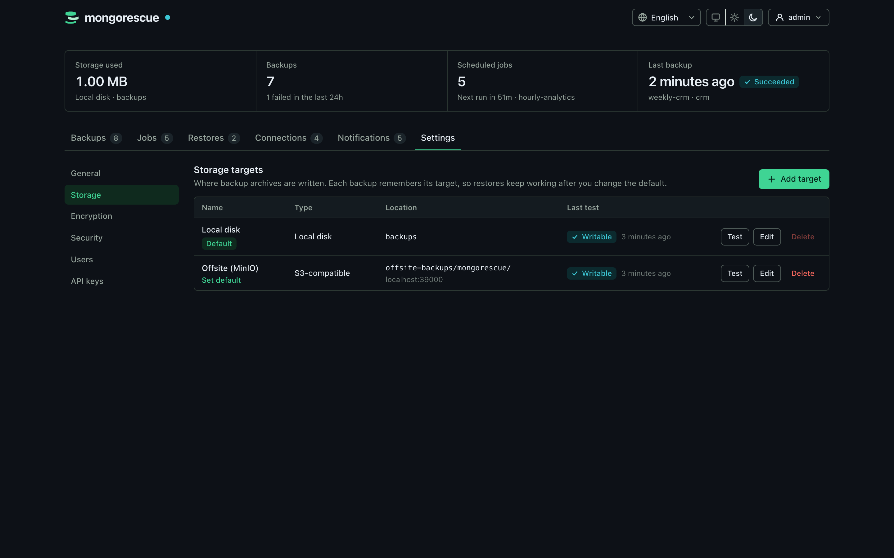

# Configuration

Everything is configured in the dashboard and stored in MongoRescue's database (`mongorescue.db` in the data directory): storage targets, backup encryption, security options, limits, MongoDB connections, jobs, notifications, users and API keys. There is no configuration file and nothing to set before the first start.

- [Bootstrap options](#bootstrap-options)
- [Settings](#settings) · [General](#general) · [Security](#security) · [Encryption](#encryption)
- [Storage targets](#storage-targets)
- [Upgrading: deprecated environment variables and config.json](#upgrading-deprecated-environment-variables-and-configjson)

## Bootstrap options

Only what MongoRescue needs to find its database and serve the dashboard is read from flags or the environment. Flags take precedence over environment variables.

| Flag | Environment variable | Default | Description |
| :--- | :--- | :--- | :--- |
| `-data-dir` | `MONGORESCUE_DATA_DIR` | `./data` (`/data` in the image) | Holds `mongorescue.db`, `secret.key`, the instance lock and the run logs (`logs/`) |
| `-host` | `MONGORESCUE_SERVER_HOST` | `0.0.0.0` | Listen address |
| `-port` | `MONGORESCUE_SERVER_PORT` | `8080` | Listen port |
| `-dashboard` | `MONGORESCUE_DASHBOARD` | `false` (`true` in the image) | Serve the web dashboard at `/`. Without it the server answers only the REST API, `/mcp` and `/metrics`, and `GET /` returns 404 |
| `-tools-dir` | `MONGORESCUE_TOOLS_DIR` | none | Absolute directory searched first for `mongodump` and `mongorestore` (see [MongoDB Database Tools](#mongodb-database-tools)) |
| `-tmp-dir` | `MONGORESCUE_TMP_DIR` | the system temporary directory (`TMPDIR`) | Absolute directory of the short-lived files that pass connection strings and [TLS material](connections.md#temporary-credentials-on-disk) to `mongodump` and `mongorestore` while they run; created `0700` when missing. Without it, `<data dir>/tmp` (`0700`) is used only when the system temporary directory is not writable. Leftovers are removed at startup |
| `-min-free-space-mb` | `MONGORESCUE_MIN_FREE_SPACE_MB` | `100` | Free space, in MiB, the data directory needs for a backup or restore to start; `0` turns the check off. A run refused for space fails with an error that says so (`503` from the API). See [production.md](production.md#disk-space) |
| `-notification-max-age` | `MONGORESCUE_NOTIFICATION_MAX_AGE` | `24h` | How long a notification may wait in the delivery queue (behind older ones of its channel, or across a downtime) before it is dropped as stale and counted as `expired`: a duration from `10m` to `720h`. See [notifications.md](notifications.md#delivery) |
| `-shutdown-grace` | `MONGORESCUE_SHUTDOWN_GRACE` | `0s` | How long a shutdown (SIGTERM) waits for running backups and restores before it cancels them: a duration such as `9m` or a number of seconds, up to `24h`. New runs are refused meanwhile. Keep it about a minute below the stop timeout of your process manager; see [kubernetes.md](kubernetes.md#graceful-shutdown) |
| `-log-level` | | `info` | `debug`, `info`, `warn` or `error` |
| | `MONGORESCUE_SECRET_KEY` | generated | Base64 32-byte key encrypting stored credentials (`openssl rand -base64 32`), instead of the generated `<data_dir>/secret.key` |
| `-version` | | | Print the version and exit |

The desktop app has its own defaults (dashboard always on, data directory in the per-user configuration directory, no listener); see [desktop.md](desktop.md#data-and-logs).

### MongoDB Database Tools

Backups and restores run `mongodump` and `mongorestore`. MongoRescue uses the first match of:

1. the directory given by `-tools-dir` / `MONGORESCUE_TOOLS_DIR` (must be an absolute path; a relative one is rejected at startup);
2. `tools/` next to the MongoRescue executable (`<install dir>\tools\mongodump.exe` on Windows, `<dir>/tools/mongodump` on Linux and macOS);
3. on macOS, when MongoRescue runs from `<name>.app/Contents/MacOS/`, `Contents/Resources/tools/` inside the bundle (`MongoRescue.app/Contents/Resources/tools/mongodump`);
4. `PATH`;
5. well-known install directories, for when MongoRescue starts with a minimal `PATH` (such as the macOS desktop app launched from Finder, which sees only `/usr/bin:/bin:/usr/sbin:/sbin`): `/opt/homebrew/bin`, `/usr/local/bin` and `/opt/local/bin` on macOS; `%ProgramFiles%\MongoDB\Tools\<version>\bin` on Windows (highest version first); `/usr/local/bin`, `/usr/bin` and `/snap/bin` on Linux.

The desktop app packages ship `mongodump` and `mongorestore` in the locations of steps 2 and 3 ([details](desktop.md#install)), so they are found without any setup. On Windows `.exe` is appended. Only regular, executable files count. The paths found are logged at startup; a missing tool is logged as a warning with the searched locations, and backups or restores then fail with `mongodump not found: install MongoDB Database Tools or set MONGORESCUE_TOOLS_DIR` (the searched paths appear only in the log).

`mongorescue mcp`, the stdio bridge for AI assistants, reads only `--url`/`MONGORESCUE_MCP_URL` and `MONGORESCUE_MCP_API_KEY` and never opens the data directory; see [mcp.md](mcp.md#transports).

The CLI commands (`mongorescue backup`, `restore`, `list`, `verify`, `status`) are clients of a running instance and never open the data directory either. They read only `--url`/`MONGORESCUE_URL` (default `http://127.0.0.1:8080`) and the API key from `--api-key-file`, `MONGORESCUE_CLI_API_KEY_FILE`, `MONGORESCUE_CLI_API_KEY` or `--api-key`, in that order; never `MONGORESCUE_API_KEY` or `MONGORESCUE_API_KEY_FILE`, which the server imports as an admin key. See [cli.md](cli.md#connecting).

The metadata database is always `<data_dir>/mongorescue.db`. The key (from `secret.key` or `MONGORESCUE_SECRET_KEY`) encrypts connection strings, notification secrets, storage credentials and encryption keys in the database. Losing it makes them unrecoverable, and MongoRescue refuses to start with a key that does not match the database rather than silently discard them. Keep a copy apart from database backups; see [production.md](production.md#data-directory).

## Settings

Only administrators (the `admin` dashboard role, or an `admin` API key of an administrator) can change settings and storage targets and use the test endpoints, which make outbound connections to the hosts they name. Give other people the `viewer` or `operator` role; see [design/roles.md](design/roles.md).

**Settings** in the dashboard has the sections General, Storage, Integrity, Encryption, Recovery, Security, Monitoring, Audit log, Users, Single sign-on, API keys and Sessions. Changes apply to the next backup, restore or request without a restart. The same settings are available through `GET` and `PUT /api/v1/settings` ([API](api.md#settings)); durations are Go duration strings such as `90m` or `6h` (`0s` disables a limit), and secrets come back as `******`.

### General

| Setting | Default | Description |
| :--- | :--- | :--- |
| `default_retention_days` | `30` | Pre-filled for new jobs; `0` keeps backups forever |
| `default_retention_count` | `10` | Pre-filled for new jobs; `0` keeps any number |
| `default_gzip` | `true` | Compress new jobs and manual backups that do not say otherwise |
| `backup_timeout` | `6h` | Maximum duration of one backup (`0s` = unlimited) |
| `backup_stall_timeout` | `10m` | Abort a backup when `mongodump` produces no output for this long (`0s` = off) |
| `restore_timeout` | `12h` | Maximum duration of one restore, verification included (`0s` = unlimited) |
| `storage_stall_timeout` | `5m` | Fail an upload when its storage target accepts no bytes for this long, 1m to 1h; see [stalled uploads](#stalled-uploads) |
| `post_restore_command_timeout` | `60s` | Maximum duration of each [post-restore command](api.md#post-restore-commands) of a connection, 1s to 24h; a command that takes longer fails the restore |
| `restore_verify_policy` | `auto` | `always`, `auto` or `never`; decides for safe clones only, in-place restores are always verified; see [encryption.md](encryption.md#verify-before-restore) |
| `log_retention_days` | `30` | Keep the log of every backup and restore run (`<data_dir>/logs/<id>.log`, redacted, at most 5 MiB each) for this many days; `0` keeps them until their backup is purged. See [api.md](api.md#run-logs) |
| `max_upload_mbps` | `0` | Cap the upload of every backup whose job sets no `max_upload_mbps` of its own, in megabits per second (`0` = unlimited, at most `100000`). See [production.md](production.md#throttling) |

Read preferences, the limit of concurrent backups per connection, and the parallelism and backup window of a job are set on the connection or job itself (dashboard forms or the API), not in Settings; see [production.md](production.md#large-databases) and [api.md](api.md#read-preferences-throttling-and-backup-windows).

Retention is applied only after a successful **scheduled** (cron) run of a job, and only to that job's own scheduled backups: every backup record has a `trigger` (`scheduled`, `on_demand`, `manual` or `mcp`), and on-demand job runs (`POST /api/v1/jobs/{id}/run`, the MCP `run_job` tool), manual backups and MCP backups neither prune nor count towards the kept backups; they stay until an admin deletes them. Two floors protect good backups: the newest `retention_count` scheduled backups of the job (at least one) are always kept, and count-based retention never deletes a backup less than 24 hours old. Pinned backups and the job's newest verified backup are never deleted either, and every deletion is recorded in the job's retention history; see [verification.md](verification.md#retention). Backups recorded before triggers existed count as `scheduled` when they belong to a job and as `manual` otherwise.

Retention deletes like a user does: softly. A backup it selects becomes `deleted` and keeps its archive for the delete grace period (`security.delete_grace_days`); the purge removes the archive afterwards, and until then the deletion can be undone. A shorter retention (fewer days, fewer backups, or a rule where there was none) takes effect only after the current grace period; a longer one applies at once. See [security.md](security.md#delete-protection).

### Integrity

| Setting | Default | Description |
| :--- | :--- | :--- |
| `verify_after_backup` | `true` | Re-read every archive after its upload; a backup whose stored bytes differ fails. Jobs can override it (`verify_after_backup`: `on`, `off`) |
| `verify_decrypt` | `false` | Also decrypt encrypted archives to their end when verifying (needs the identity or passphrase) |
| `sweep_schedule` | `off` | Re-verify every completed backup `daily`, `weekly` or `monthly`, least recently verified first |
| `sweep_bandwidth_limit` | `0` | Read limit of the sweep in MiB/s (`0` = unlimited) |
| `storage_scan` | `true` | Compare every storage target with the backup records once a week (orphan and missing archives; nothing is deleted) |

See [verification.md](verification.md) for what each check proves.

### Metadata backups

Scheduled snapshots of MongoRescue's own database (Settings → Recovery); see [production.md](production.md#metadata-backups).

| Setting | Default | Description |
| :--- | :--- | :--- |
| `enabled` | `false` | Take a snapshot of `mongorescue.db` on a schedule |
| `interval` | `24h` | Time between snapshots (1h to 720h); a failed snapshot is retried after at most an hour |
| `target_id` | empty | Storage target the snapshots are written to, under `_mongorescue/metadata/<install_id>/`, an ID derived from `secret.key` (empty = the default target) |
| `retention_count` | `14` | Snapshots kept on the target (1 to 1000); older ones are deleted after each snapshot, but never one younger than `security.delete_grace_days`. A lower value takes effect only after the current grace period (with the two-person rule, after an approval first); see [security.md](security.md#metadata-snapshots) |

### Security

| Setting | Default | Description |
| :--- | :--- | :--- |
| `session_idle_timeout` | `12h` | End a session after this long without requests (1m to 8760h) |
| `session_absolute_timeout` | `168h` | End a session this long after login; not shorter than the idle timeout. Shortening it also ends existing older sessions |
| `secure_cookies` | `auto` | `auto`: `Secure` over TLS or behind a trusted proxy reporting `X-Forwarded-Proto: https`; `always`: for a TLS proxy that does not send it; `never`: plain-HTTP tests only |
| `trust_proxy_headers` | `false` | Honour `X-Forwarded-For` / `X-Real-IP` (login throttling, the client address in the audit log) and `X-Forwarded-Proto`. Enable only behind a proxy that sets them |
| `cors_origins` | empty | Exact origins (`https://ops.example.com`) allowed to call the API cross-origin; no wildcards. Empty disables CORS |
| `metrics_public` | `false` | Serve `/metrics` without an API key |
| `mcp_enabled` | `true` | Serve the [MCP endpoint](mcp.md) `/mcp` for AI assistants (API keys only). When off it answers `403` and the stdio bridge cannot connect |
| `delete_grace_days` | `7` | Delete grace period, 1 to 90 days: a deleted backup (by a user, an API key or retention) keeps its archive this long and can be undone; the purge removes it afterwards. A higher value applies at once (also to deletions made before); a lower one takes effect only after the current grace period (and, with `require_second_approver`, after a second administrator's approval). See [security.md](security.md#delete-protection) |
| `require_second_approver` | `false` | Two-person rule: deleting backups or storage targets, shortening retention, unpinning, lowering `delete_grace_days` or `metadata_backup.retention_count`, in-place restores that drop the target, removing or changing a connection's post-restore commands, making, demoting or deleting administrators (users, admin API keys, single sign-on admin mappings), resetting another user's password and turning this off wait for the approval of another administrator who was one before the request, signed in to the dashboard (API keys can request but never approve). It can only be turned on while at least two administrators exist; see [security.md](security.md#the-two-person-rule) |
| `require_locked_copies` | `false` | The default of `require_locked_copies` for new jobs: a job is refused unless every copy target has S3 Object Lock. Turning it on applies at once; turning it off takes effect after the delete grace period (and, with `require_second_approver`, after a second administrator's approval). See [locked copies](production.md#locked-copies) |

### Monitoring

The outbound heartbeat to an external dead-man's switch (Settings → Monitoring); see [monitoring.md](monitoring.md).

| Setting | Default | Description |
| :--- | :--- | :--- |
| `heartbeat_url` | empty | `http` or `https` URL (healthchecks.io compatible) pinged with `GET` every interval while the scheduler is healthy (empty = off). Secret: stored encrypted, shown only up to its host. Sending the masked value back keeps it; a masked value for another host is refused, so a new host needs the full URL |
| `heartbeat_interval` | `5m` | Time between pings (1m to 1h) |

Jobs have their own optional `heartbeat_url`, pinged at `<url>/start`, `<url>` and `<url>/fail` (see [monitoring.md](monitoring.md#job-heartbeats)).

### Audit log

Retention and forwarding of the hash-chained audit log of every action (Settings → Audit log); see [audit.md](audit.md).

| Setting | Default | Description |
| :--- | :--- | :--- |
| `retention_days` | `365` | Keep entries this many days (30 to 36500); older ones are removed hourly, and the last removed hash is kept as the chain anchor |
| `webhook_url` | empty | `http` or `https` URL every new entry is POSTed to as JSON, in the background (empty = off). Secret: stored encrypted, shown only up to its host |
| `webhook_secret` | empty | Signs the forwarded requests (`X-MongoRescue-Signature: sha256=<HMAC-SHA256 of the body>`). Secret. Changing the webhook host needs it again: the stored secret is never kept for another host |

### Single sign-on

Sign-in through an OpenID Connect provider (Settings → Single sign-on, admins only); see [sso.md](sso.md) for provider recipes and [design/oidc.md](design/oidc.md) for the design. Not available in the desktop app.

| Setting | Default | Description |
| :--- | :--- | :--- |
| `enabled` | `false` | Show the single sign-on button and accept sign-ins. Turning it on checks the section, fetches the provider's discovery document and needs at least one local administrator |
| `display_name` | `Single sign-on` | Label of the sign-in button (at most 64 characters) |
| `issuer` | empty | Issuer URL: `https`, `http` only for `localhost`/loopback. Discovery must report exactly this issuer. For Entra ID a tenant issuer; `/common` and `/organizations` are refused |
| `client_id` | empty | The client registered at the provider |
| `client_secret` | empty | Its secret: stored encrypted, shown as `******`; sending the mask back keeps it. Empty means a public client (PKCE only) |
| `scopes` | `openid email profile` | Requested scopes; `openid` is always added |
| `redirect_url` | empty | The callback URL registered at the provider, never derived from the request. Its path must be exactly `/auth/oidc/callback`. The dashboard pre-fills `<origin>/auth/oidc/callback` |
| `username_claim` | `preferred_username` | Names new users; falls back to `email`, then `sub`, cleaned to the username characters |
| `groups_claim` | `groups` | Claim holding a string or a list of strings: an exact top-level claim name first (namespaced claims such as `https://app.example.com/groups`), else a dot path (`realm_access.roles`) |
| `role_mappings` | empty | `{group, role, all_connections, connection_ids}`, matched exactly; the highest role wins; at most 100. `all_connections: true` grants every connection with the role; otherwise exactly `connection_ids` (an empty list is none; a mapping with neither field has every connection; `admin` mappings always have every connection). Only the mappings that grant the user's role count: the union of their lists, or every connection when one of them has `all_connections`, so a lower role never widens a higher one (G1 → operator on A plus G2 → viewer on everything: operator on A only). See [connection access](api.md#single-sign-on) |
| `default_role` | empty | Role when no mapping matches: empty refuses the sign-in, or `viewer` or `operator`. `admin` is refused here: it only comes from a mapping. Without any mappings it is only the role of new users; existing users keep theirs |
| `allowed_email_domains` | empty | Only verified emails (`email_verified` the JSON boolean `true`) of these exact domains may sign in; empty allows any |
| `auto_create_users` | `true` | Create a user at an identity's first sign-in; when off, unknown identities are refused |
| `local_login` | `all` | `admins_only` limits the password form to local administrators (break-glass) while single sign-on is on, and ends the sessions of the other local users when switched on |
| `rp_logout` | `false` | Sign single sign-on users out at the provider too (`end_session_endpoint`, with the client ID only) |

### Encryption

Backups can be encrypted with [age](https://age-encryption.org) before they leave the host; see [encryption.md](encryption.md).

| Setting | Description |
| :--- | :--- |
| `enabled` | Encrypt new backups. Turning it off never affects existing backups |
| `mode` | `x25519` (public keys, recommended) or `passphrase` (scrypt) |
| `recipients` | Public keys (`age1…`) new backups are encrypted to; at least one is required in `x25519` mode |
| `identity` | Private key(s) (`AGE-SECRET-KEY-1…`) used by restores. Optional: an instance with recipients only can back up but not restore |
| `passphrase` | Passphrase for `passphrase` mode (at least 16 characters); also used to restore scrypt backups |
| `retired_keys` | Read-only. Replaced or removed identities and passphrases, kept encrypted so that older backups stay restorable |

**Generate key pair** (`POST /api/v1/settings/encryption/generate-key`) creates an X25519 key pair without storing it. The private key is shown once: copy or download it and keep it somewhere safe, apart from the backups. **Losing every copy of the private key makes the backups encrypted to it unrecoverable.** Choosing *Use this key* stores the private key (encrypted) and adds its public key to the recipients; the previous identity is retired, not deleted.

## Storage targets

A storage target is where backup archives are written: a directory on the MongoRescue host (or a mounted volume) or an S3-compatible bucket (AWS S3, Cloudflare R2, Backblaze B2, MinIO, DigitalOcean Spaces, Wasabi). On the first start MongoRescue creates **Local disk**, a local target at `backups` next to the data directory (`/backups` in the image, `./backups` for the binary with the default data directory), and makes it the default.

- **Default target.** Jobs and manual backups that name no `storage_target_id` use the default target. The default is changed with *Set default*; it cannot be deleted.
- **Backups stay with their target.** Every backup record stores the target it was written to (`storage_target_id` and a name snapshot). Restores, deletions and retention always use that target, never the current default. Retention counts per target: backups a job left on a previous target are not pruned by runs on the new one.
- **Deleting a target** is refused (`409`) while a job uses it or any backup record but purged ones references it (deleted backups waiting for their purge included), so every backup that can still be restored or undeleted keeps its target. Reassign the jobs, delete those backups and wait for their purge (the delete grace period) first. A target nothing references is deleted at once (with the two-person rule, after a second administrator's approval).
- **The location is fixed once backups are stored.** While backup records (any but purged ones) reference a target, its type, local path, S3 endpoint, bucket and prefix cannot change (`409`): the records would point to a place that does not hold them. Create a new target instead and move the jobs to it. The name can always be changed; new credentials, region or path style of a target that holds backups must pass a connection test first, or the change is refused (`409`) and the target keeps its settings.
- **Region.** `region` labels where the target's data lives, for the [cross-region checks](production.md#region-awareness) of the readiness report (at most 64 characters, optional). On AWS S3 (no endpoint) a target without one uses its `s3.region`, or, when that is empty or `auto`, its bucket's location (`s3:GetBucketLocation`), stored with `region_detected: true` and detected again when the endpoint, bucket or `s3.region` changes. On other endpoints (MinIO, Cloudflare R2, Backblaze B2 and other providers) and local targets only an operator's label counts: their `s3.region` is a signing parameter. An update without `region` keeps it.
- **Concurrent edits** are detected: an update of a target that was changed or deleted meanwhile answers `409` or `404` instead of overwriting or recreating it.
- **Test** writes, reads back and deletes a small object named `.mongorescue-probe-<random>` in the target's root (or prefix); it creates no directory. Testing an unsaved local target whose directory does not exist reports that instead of creating it; saving the target creates the directory. The dashboard tests before saving.

| Field | Description |
| :--- | :--- |
| `name` | Display name |
| `type` | `local` or `s3` |
| `local.path` | Absolute path. `..`, the file system root, the data directory and anything inside it (symbolic links resolved) are refused; the directory is created on save and must be writable |
| `s3.endpoint` | S3 API URL; empty for AWS S3 (e.g. `https://<account>.r2.cloudflarestorage.com`, `https://s3.<region>.backblazeb2.com`, `http://minio:9000`) |
| `s3.region` | Bucket region (`auto` for R2; default `us-east-1`) |
| `s3.bucket` | Bucket name (must exist) |
| `s3.prefix` | Optional key prefix, e.g. `mongorescue/` |
| `s3.access_key_id`, `s3.secret_access_key` | Static credentials. Leave both empty to use the AWS default credential chain (instance role, `AWS_*` variables of the container). The secret key is encrypted in the database and shown as `******`; sending `******` back keeps it only while endpoint, bucket and access key are unchanged |
| `s3.use_path_style` | Path-style URLs (required by MinIO and some gateways) |
| `s3.part_size_mb` | Multipart upload part size in MiB, 5 to 512 (default 16). S3 allows 10,000 parts, so it caps one archive: 16 MiB allows about 156 GiB, 64 MiB about 625 GiB. Each running upload buffers part size × 2. Backups warn when a database's expected archive exceeds 80% of that limit; see [S3 multipart limits](production.md#s3-multipart-limits). Changing it needs no connection test and applies to the next backup |

| `s3.object_lock` | `none` (default), `governance` or `compliance`: the [S3 Object Lock](#immutable-backups-s3-object-lock) mode set on every uploaded object. The bucket must have Object Lock enabled |
| `s3.retention_days` | How long every upload is locked, 1 to 3650 days; required with a lock mode, `0` without |
| `s3.legal_hold_on_pin` | Set an S3 legal hold on a backup's archive while the backup is pinned (needs a lock mode) |

Each target gets its own driver, built on first use and rebuilt after the target changes.

### Stalled uploads

Every upload to a storage target (backup archives, PITR base backups and oplog chunks, copies, metadata snapshots, re-encrypted archives and the connection probe) runs under a progress watchdog. When the target accepts no bytes for `general.storage_stall_timeout` (default `5m`), the upload is cancelled and fails with `storage: upload stalled: no upload progress for 5m0s to target "<name>"`: a backup is recorded `failed` (never `completed`), its partial multipart upload is aborted and the partial artifact removed, and the next run starts afresh. Progress is any byte the uploader takes from the stream and, for S3, any byte of a request body sent or of a response received. Time spent waiting for the source (a slow `mongodump`, which `backup_stall_timeout` covers, or the upload cap `max_upload_mbps`) never counts, so a throttled but steady upload is not a stall. The setting applies to every target and to the next upload after a change. A local target on a hung network mount fails once its blocked write returns; a write blocked in the kernel cannot be interrupted.

The S3 driver bounds its HTTP client as well, where the AWS SDK leaves the wait for response headers unlimited: connections are established within 30 seconds, TCP keep-alive probes run every 30 seconds, the TLS handshake is bounded to 10 seconds, response headers must arrive within 2 minutes of a fully sent request, and idle pooled connections close after 90 seconds.

### Immutable backups (S3 Object Lock)

With `s3.object_lock` set, every object MongoRescue uploads to the target (backup archives, PITR base backups, oplog chunks and metadata snapshots) carries an S3 Object Lock retention in that mode until the end of its upload plus `s3.retention_days`. Until then nobody can delete or overwrite that version: in **compliance** mode not even the bucket owner or the AWS root account, in **governance** mode nobody without `s3:BypassGovernanceRetention`. This covers deletion on the storage side, which [delete protection](security.md) cannot (see the [threat model](security.md#immutable-backups-s3-object-lock)).

- **The bucket must be created with Object Lock.** Saving or testing a target with a lock mode reads the bucket's Object Lock configuration (`GetObjectLockConfiguration`) and versioning state and refuses the target (`400`) when Object Lock is not enabled or versioning is off. MongoRescue never enables either itself: Object Lock cannot be turned off once on, so that is the bucket owner's decision.
- **Uploads carry a checksum.** S3 requires `Content-MD5` or an `x-amz-checksum-*` header on every put with a retention. The driver otherwise sends checksums only when an operation requires them (some S3-compatible providers reject them), so locked targets, and only those, send CRC32 checksums, computed while streaming for every part of a multipart upload. The retain-until date is set when an upload starts; when an upload ends later than that date minus the retention (a long upload), it is extended with `PutObjectRetention`, so no object is locked for less than `retention_days`.
- **Versions, on locked targets only.** Object Lock needs versioning, and on a versioned bucket deleting a key only adds a delete marker: the data stays, and is billed, until the version itself is deleted. On a locked target MongoRescue records the S3 version ID of every upload (`storage_version_id` on backups, `version_id` on oplog chunks), restores and verifications read that version, and every deletion (the purge of deleted backups and oplog chunks, orphan oplog chunks, uncommitted chunks, the artifacts of failed backups, metadata snapshot retention and the connection test's probe) lists all versions and delete markers of the key, waits while one is still locked, and then deletes each by its ID, so the space is freed. A record is never marked purged while a version still exists, also when it was recorded without a version (an imported orphan, a backup taken before the target was locked): the purge reads the versions' retain-until dates first. Targets without a lock behave as before, even on buckets that return versions (such as Backblaze B2): no versions are recorded or read, and deletes are plain `DeleteObject` calls, which leave a delete marker on a versioned bucket. A lifecycle rule that expires noncurrent versions is optional for locked targets and still useful for unlocked targets on versioned buckets.
- **Retention and purge wait for the lock.** A deleted backup or oplog chunk stays `deleted` after its grace period while its archive is locked, and the purge removes it once `retain_until` has passed. Backups show `retain_until` and `object_lock_mode` ("Locked until …" in the dashboard). A failed or cancelled backup whose artifact was already uploaded keeps it as `archive_cleanup_pending` until the purge can delete it. Metadata snapshot retention keeps locked snapshots until their lock ends.
- **Lowering the lock follows delete protection.** A weaker mode (governance instead of compliance, or none), a shorter `retention_days` or turning `legal_hold_on_pin` off is stored as a pending change and applied only after the delete grace period (with the [two-person rule](security.md#the-two-person-rule), after a second administrator approved it), like a shorter job retention; the target keeps its current lock meanwhile. The update answers `pending_object_lock` (or `approval`), Settings → Security lists it, and an administrator can cancel it. Raising the lock applies at once, and an edit that raises it drops a pending lowering. Objects already uploaded always keep their own lock.
- **Job retention shorter than the lock** is allowed, but saving such a job answers with a warning: retention marks the backups deleted, and storage keeps them, and their cost, until their lock ends.
- **Legal hold on pin.** With `s3.legal_hold_on_pin`, pinning a backup sets an S3 legal hold on its archive and unpinning lifts it; the hold has no end date and blocks deletion even after the retention. Unpinning needs the admin role and, with the two-person rule, a second administrator's approval; the hold is lifted only when the unpin runs. Pins and unpins hold the backup's deletion lock across the S3 call and the record update, a pin or unpin whose hold change fails is refused (`502`), and an unpin whose hold cannot be lifted gets its pin back, so the record and storage always agree.
- **Key rotation.** Re-encryption after an age key rotation reads the old archive by its recorded version and uploads the new one with the target's lock; the backup then records the new version and lock, and a pinned backup's legal hold is set on the new archive. The old archive goes to a tombstone that keeps its version, lock and legal hold, and the purge deletes every version of it only after the grace period and its lock (lifting the hold first). A new archive that has to be discarded is already locked, so it is recorded as a deleted backup the purge removes once its lock ends. Credential rotation probes a locked target like the connection test (an unlocked probe whose versions are all deleted) and adds an `object_lock` step that checks the new credentials can read the bucket's Object Lock and versioning; retired metadata snapshots on a locked target are deleted once their lock ends.
- **Connection test.** The probe object of a locked target is written without a lock and all its versions are deleted afterwards, so tests leave nothing behind; a bucket with a *default retention* rule locks the probe anyway (it is deleted by no one until that ends), so prefer the target's own lock mode to a bucket default.
- **Hints.** A target without Object Lock shows an info hint (backups can be deleted with the bucket credentials), a governance-mode target a warning (principals with `s3:BypassGovernanceRetention` can delete), in the dashboard, in the target API (`hints`) and in the [readiness report](api.md#recovery-readiness) (`storage_hints`). Local targets have no immutability option: a local delete is a plain file removal, so only delete protection's grace period protects them.

**Permissions** of a locked target's credentials: `s3:PutObject`, `s3:PutObjectRetention`, `s3:GetObject`, `s3:GetObjectVersion`, `s3:GetObjectRetention`, `s3:ListBucket`, `s3:ListBucketVersions`, `s3:AbortMultipartUpload`, `s3:DeleteObjectVersion` (for the purge once locks end), `s3:GetBucketObjectLockConfiguration`, `s3:GetBucketVersioning` and, with `legal_hold_on_pin`, `s3:PutObjectLegalHold` and `s3:GetObjectLegalHold`. Never grant `s3:BypassGovernanceRetention`.

**Creating a lock-enabled bucket:**

- **AWS S3:** `aws s3api create-bucket --bucket NAME --object-lock-enabled-for-bucket` (add `--create-bucket-configuration LocationConstraint=REGION` outside `us-east-1`); this also turns versioning on. An existing bucket can be switched once and irreversibly: enable versioning, then `aws s3api put-object-lock-configuration --bucket NAME --object-lock-configuration '{"ObjectLockEnabled":"Enabled"}'`.
- **MinIO:** `mc mb --with-lock ALIAS/NAME`.
- **Wasabi:** enable Object Lock when creating the bucket in the console, or use the AWS CLI command above with `--endpoint-url https://s3.<region>.wasabisys.com`.
- **Backblaze B2:** enable Object Lock on the bucket (when creating it or on an existing bucket, irreversibly) and use the S3 endpoint `https://s3.<region>.backblazeb2.com`.
- **Other providers:** create the bucket with Object Lock enabled through the provider's console or its S3 API (`CreateBucket` with `x-amz-bucket-object-lock-enabled: true`), then save and test the target.

| Provider | S3 Object Lock API | Source |
| :--- | :--- | :--- |
| AWS S3 | Supported: governance, compliance, legal hold | [Amazon S3 User Guide: Object Lock](https://docs.aws.amazon.com/AmazonS3/latest/userguide/object-lock.html) |
| MinIO | Supported: governance, compliance, legal hold | [MinIO: Object Locking and Immutability](https://min.io/docs/minio/linux/administration/object-management/object-retention.html); tested in MongoRescue's integration suite |
| Wasabi | Supported: governance, compliance, legal hold | [Wasabi: Object Lock](https://docs.wasabi.com/docs/object-locking) |
| Backblaze B2 | Supported: governance, compliance, legal hold | [Backblaze B2: Object Lock](https://www.backblaze.com/docs/cloud-storage-object-lock) |
| Cloudflare R2 | Not supported through the S3 API: the object lock headers and `GetObjectLockConfiguration` are listed as unsupported. R2 has its own *bucket locks* instead, which MongoRescue cannot set or check | [R2 S3 API compatibility](https://developers.cloudflare.com/r2/api/s3/api/), [R2 bucket locks](https://developers.cloudflare.com/r2/buckets/bucket-locks/) |
| DigitalOcean Spaces | Not verified | |
| Other S3-compatible providers | Not verified | |
| Local disk | No immutability option | |

Provider support changes, and this table only lists what the providers' own documentation stated when it was written. **The save-time bucket check is authoritative**: save (or test) the target with a lock mode, and MongoRescue tells you whether your bucket has Object Lock and versioning enabled.

### Copies on a second target (3-2-1)

A job, or a manual backup, can list up to three **copy targets** besides its primary storage target (`copy_targets`, storage target IDs; never the primary). Every backup is then copied to each of them. See [3-2-1 backups](production.md#3-2-1-backups) for how to set this up.

| Field | Description |
| :--- | :--- |
| `copy_targets` | Up to 3 storage target IDs the archive is copied to. On a job update, an empty list removes them and an omitted field keeps them |
| `copy_mode` | `async` (default): the backup completes once its primary archive is stored and verified, and the copy queue copies it afterwards. `sync`: the backup completes only once every copy succeeded |

- **What is copied.** The archive is streamed from the primary target (`Retrieve`) into the copy target (`Save`). mongodump never runs again and nothing is buffered beyond the drivers' part buffers. The bytes are hashed on the way: when they do not match the backup's SHA-256 and size, the stream fails before the copy target completes the object, so a damaged primary is never copied. The copy holds the same bytes, encrypted or not, under the same storage key.
- **Records.** The backup gets one entry per copy in `copies`: `target_id`, `target_name`, `storage_key`, `status` (`pending`, `done`, `failed`, `purged`), `sha256_ok`, `version_id`, `object_lock_mode`, `retain_until`, `error`, `copied_at`, `attempts`, `next_attempt_at` and the copy's own `verification`, `verified_at` and `verification_error`.
- **The copy queue** is the backup records themselves, so it survives restarts. It wakes up for every succeeded backup and also checks every minute. It tries each pending copy and retries a failed one with backoff: 1 minute, doubled for every attempt up to 6 hours, at most 10 attempts. The first failure of a copy publishes `backup.copy_failed`, and a copy that succeeds after failing publishes `backup.copy_recovered`. When the last attempt fails, the queue publishes `backup.copy_exhausted` and stops loading that backup. An administrator queues it again with `POST /api/v1/backups/{id}/copies/retry`, which resets the attempts. Each upload is written and recorded under the deletion lock of its object, the lock the purge takes. A backup deleted during an upload therefore keeps the copy for its purge, and a copy whose backup record is gone is deleted again. Metrics: `mongorescue_backup_copies_total{result="ok|mismatch|error"}` and `mongorescue_backup_copy_queue_depth`.
- **Throttling and windows.** Copies upload at most at the job's `max_upload_mbps`, else at the general `max_upload_mbps`. Copies run **outside backup windows** too: a window protects the MongoDB server from mongodump, and copies read only storage.
- **Synchronous copies.** In `sync` mode a copy is tried three times inside the backup run. When it still fails, the backup fails, and its archive and the copies already made are deleted. A copy under an Object Lock is left to the purge, like the artifact of any failed backup.
- **Object Lock per target.** Each copy is uploaded with its copy target's own lock settings. Its `version_id` and `retain_until` are recorded per copy, and reads and deletions address that version.
- **Restores** read the primary by default. A restore can name `source_target_id` (the primary, or a target holding a `done` copy; `--from-target` on the CLI, the *Read the archive from* select in the dashboard). Without it, a restore falls back to the first healthy copy when the primary archive cannot be used: it is recorded missing, failed its last verification, or the object is missing or has another size on its target. The restore record then has `source_target_id`, `source_target_name` and `source_fallback`, and the preflight's `source` check reports which archive is read. The fallback checks the object's size, not its content: a damaged archive of the right size is only detected by verification (the integrity sweep, or the restore's *verify first*). A restore that finds the archive it reads not matching its checksum fails, is not retried, and records the mismatch: on the backup when it read the primary (`verification: "mismatch"`), so the next restore reads a healthy copy by itself, or on the copy it read, which is then copied again.
- **Verification.** Sweeps and on-demand verifications re-read every `done` copy too, and record the result on the copy (`copies_ok`, `copies_mismatch` and `copies_errors` in the sweep status). A copy that is damaged or gone is queued again and copied from the primary once more, with `backup.copy_failed`.
- **Deletion and purge.** Deleting a backup soft-deletes its copies with it: the same delete grace period, and the same undelete. The purge then deletes each copy from its own target, every version on a locked target, and only once that target's lock has ended. The backup stays `deleted` while a copy is still locked.
- **Target deletion.** A storage target is in use (`409`) while a job or a PITR stream lists it as a copy target, or a backup or an oplog chunk holds a `pending` or `done` copy on it (or a copy still under its lock), as with primaries. Storage scans of a copy target never report its copies as orphans.
- **Locked copies.** A job with `require_locked_copies` is refused (`400`) unless every copy target has an Object Lock mode; `security.require_locked_copies` is the default for new jobs. See [locked copies](production.md#locked-copies).
- **Regions.** Each storage target has a `region` (the dashboard's *Region label*): an S3 target takes its `s3.region`, or its bucket's location when that is empty or `auto`; a local target takes the label you give it. The readiness report warns with `dr_same_region` and `dr_same_credentials` for jobs whose copies share the primary's region or credentials; see [region awareness](production.md#region-awareness).
- **DR drills.** A job's restore test can read a copy target (`restore_test.source_target_id`, *Read the archive from (DR drill)* in the job form); see [DR drills](production.md#dr-drills).
- **PITR streams** take `copy_targets` too: base backups are copied like a job's backups, and the copy queue copies every live oplog chunk with its checksum checked (one `oplog_chunk_copies` row per chunk and target, migration 0027), retries it with the same backoff, counts it in `mongorescue_backup_copy_queue_depth`, and purges the copy after its chunk (and after the copy's own lock). A point-in-time restore reads a copy chain when asked (`source_target_id`) or when the primary base or a chunk cannot be read; a chain is used only when every chunk in the range has a completed copy on that target. The integrity sweep does not re-read chunk copies yet.
- **Access.** Copy targets follow the [per-connection access](security.md) rules of primaries: a caller limited to some connections may only name the targets it sees, and a target holding copies of its backups is one of them.
- **Readiness.** A row shows the copies of its newest good backup ("1 copy", "1 of 2 copies"). It warns with `copy_missing` while some of those copies are not done six hours after the backup finished, and while any completed backup of the database has a copy the queue gave up on.
- **Crashes.** A backup left in progress by a crash is failed on the next start: its pending copies are marked failed (they keep no target in use), and copies a synchronous run had already made are deleted by the purge (`archive_cleanup_pending`).
- **Key rotation.** Re-encrypting a backup hands the copies of its old archive to the tombstone record that keeps the old archive through the grace period, so the purge removes exactly those objects. The backup's copies are queued again under the new key and copied from the new archive. A copy records the checksum it was checked against (`sha256`), and a restore never reads a copy whose checksum is not the backup's current one.

## Upgrading: deprecated environment variables and config.json

Earlier builds read every setting from environment variables or a JSON file. Those are no longer used; the flags `-config`, `-api-key`, `-mongo-uri`, `-storage` and `-gen-age-key` are gone (the dashboard generates encryption keys).

To keep existing deployments working, MongoRescue imports them **once**: when one of the variables below, or a legacy file at `<data_dir>/config.json`, is present at startup and the database has no value for that setting yet, the value is imported into the database and a warning asks you to remove the variable. Every source is recorded as imported, so later starts ignore it (with a warning) even if the setting is changed in the dashboard afterwards. Values that cannot be interpreted are skipped with a warning.

| Deprecated source | Imported as |
| :--- | :--- |
| `MONGORESCUE_STORAGE_TYPE`, `MONGORESCUE_LOCAL_PATH` (a relative path is resolved against the working directory at import time and stored absolute), `AWS_S3_BUCKET`, `AWS_S3_ENDPOINT`, `AWS_S3_USE_PATH_STYLE` (with `AWS_REGION`, `AWS_ACCESS_KEY_ID`, `AWS_SECRET_ACCESS_KEY` for S3) | The default storage target, when no target exists yet |
| `MONGORESCUE_ENCRYPTION_ENABLED`, `_RECIPIENTS`, `_IDENTITY`, `_IDENTITY_FILE` (file content), `_PASSPHRASE` | Encryption settings (short passphrases from earlier builds are accepted) |
| `MONGORESCUE_BACKUP_TIMEOUT`, `MONGORESCUE_BACKUP_STALL_TIMEOUT`, `MONGORESCUE_RESTORE_TIMEOUT`, `MONGORESCUE_RESTORE_VERIFY` | General settings |
| `MONGORESCUE_TRUST_PROXY_HEADERS`, `MONGORESCUE_SECURE_COOKIES` (`true` → `always`), `MONGORESCUE_CORS_ORIGINS`, `MONGORESCUE_METRICS_PUBLIC` | Security settings |
| `MONGORESCUE_MONGO_URI` | A connection named `default` (when there is none), also assigned to legacy jobs without a connection string |
| `MONGORESCUE_API_KEY` | An API key named *Imported from MONGORESCUE_API_KEY* (stored as a hash; revoke it in the dashboard) |
| `<data_dir>/config.json` | The same settings from the former JSON keys (`server.*`, `storage.*`, `defaults.*`, `backup.*`, `restore.*`, `encryption.*`) |

`MONGORESCUE_DB_PATH` (and `database_path`) is not imported: if it points to an existing database outside the data directory, MongoRescue refuses to start and asks you to move that file (with its `-wal` and `-shm` files) to `<data_dir>/mongorescue.db`. A `secret_key` in a legacy `config.json` is still used when `MONGORESCUE_SECRET_KEY` is not set, with a warning to move it there.

Releases before the SQLite store kept metadata in `<data_dir>/state.json`. On the first start with an empty database it is imported automatically in one transaction and renamed to `state.json.migrated-<timestamp>`; keep that file until you have checked the imported data. If the import fails, startup stops and `state.json` is left untouched. Job connection strings (`mongo_uri`) from those releases become managed connections, one per distinct URI and named after its hosts. Existing jobs and backup records without a storage target are assigned to the default target.
