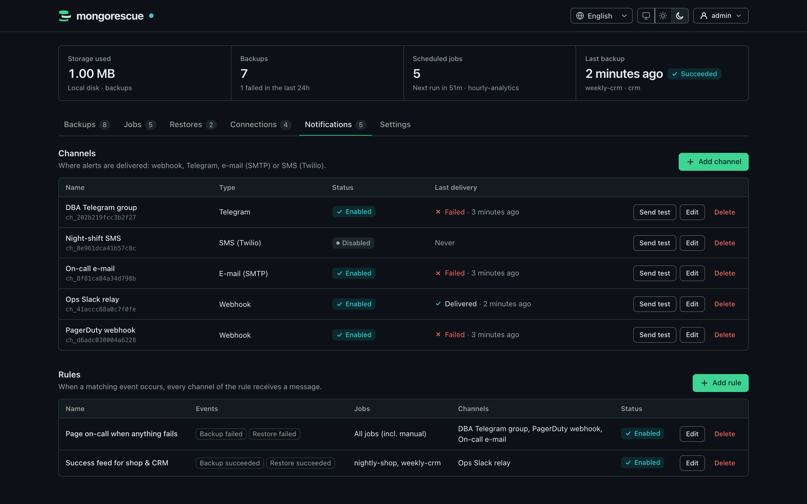

# Notifications

MongoRescue sends a message when a backup or restore finishes. Channels and rules are managed in the dashboard (Notifications tab) or through the REST API, and stored in the metadata database alongside jobs; channel secrets are encrypted there with the secret key (see [production.md](production.md#data-directory)).

## Channels



| Type | `type` | Settings (JSON object) | Secrets |
| :--- | :--- | :--- | :--- |
| Webhook | `webhook` | `webhook: {url, headers, secret}` | `secret`, credential-bearing headers |
| Telegram bot | `telegram` | `telegram: {bot_token, chat_id, parse_mode}` | `bot_token` |
| Email (SMTP) | `email` | `email: {host, port, username, password, from, to, security}` | `password` |
| SMS (Twilio) | `twilio` | `twilio: {account_sid, auth_token, from, to}` | `auth_token` |

- **Webhook** POSTs the JSON payload below to any `http://` or `https://` URL. It covers Slack incoming webhooks (the payload carries a `text` field), Discord (append `/slack` to the Discord webhook URL to use its Slack-compatible endpoint), and SMS gateways or ticketing systems that accept a JSON POST. Extra `headers` can carry an `Authorization` token.
- **Telegram** uses a bot token from @BotFather and a chat ID. `parse_mode` is empty (plain text) or `MarkdownV2`.
- **Email** `security` is `none` (plain TCP, only for local relays), `starttls` (usually port 587) or `tls` (implicit TLS, usually port 465). `to` is a list of addresses.
- **Twilio** sends an SMS to each number in `to` from the Twilio number `from`.

Secrets are masked (`******`) in every API response. When you update a channel, sending a masked value back keeps the stored secret. Changing a channel's type or destination requires re-entering its secrets, so a stored credential can never be redirected to a new endpoint without being supplied again.

Webhook and e-mail destinations may be public hosts, `localhost` or private networks (`10.0.0.0/8`, `172.16.0.0/12`, `192.168.0.0/16`, `fc00::/7`), since self-hosted receivers usually live there. Addresses that are never a receiver are refused: link-local addresses, including the cloud metadata services (`169.254.169.254`, `fd00:ec2::254`, `100.100.100.200`), unspecified, multicast and broadcast addresses, in any form (IPv4-mapped IPv6 and NAT64 `64:ff9b::/96` included). Numeric hosts must be written in dotted decimal (`127.0.0.1`, not `2130706433`, `0x7f000001` or `127.1`). The check runs when a channel is saved and again on every connection after DNS resolution, so a host name that resolves to a refused address fails as well. Webhooks honour `HTTPS_PROXY`, `HTTP_PROXY` and `NO_PROXY`; through a proxy, the target host is resolved and checked before the request is handed over, and a name the local resolver cannot resolve is left to the proxy. Webhook redirects are never followed.

Each channel has a **Send test** button (`POST /api/v1/notifications/channels/{id}/test`) that delivers a `notification.test` event and reports the result immediately. The last delivery outcome is shown on the channel (`last_delivery`).

## Rules

A rule connects events to channels:

```json
{
  "name": "Page on failures",
  "enabled": true,
  "events": ["backup.failed", "restore.failed"],
  "job_ids": ["nightly-shop"],
  "channel_ids": ["ops-webhook", "oncall-sms"]
}
```

- `events`: any of `backup.succeeded`, `backup.failed`, `restore.succeeded`, `restore.failed`, `verification.failed`, `restore_test.succeeded`, `restore_test.failed`, `storage.drift_detected`, `retention.deleted` (see [verification.md](verification.md#notifications-and-metrics)), `metadata_backup.failed` (a [metadata snapshot](production.md#metadata-backups) could not be stored; `target_id`, `error`), `restore.verification_failed` (a restore with `verify_restore` did not match the backup's manifest; `restore_id`, `database` is the restore target, the first mismatch in `detail`; see [api.md](api.md#restore-verification)), `job.databases_added` (a job that includes new databases automatically backed up new ones; `databases` names them), `job.rpo_missed` (the newest successful backup of one of a job's databases became older than the job's [recovery point objective](api.md#recovery-point-objectives); `job_id`, `database`, the age and the objective in `detail`; sent once per breach, also across restarts) and `job.rpo_recovered` (that database has a recent enough backup again). Drift events belong to no job, so only rules without `job_ids` match them. A job with several databases sends one backup event per run, not one per database: `backup.failed` for a partial run names the failed databases and how many new ones were not included ([details](api.md#jobs-with-several-databases)).
- `job_ids`: optional. Empty means every job, including on-demand backups.
- `channel_ids`: channels that receive matching events.

Security alerts are not tied to rules: *Backup encryption is off* (`security.encryption_off_after_upgrade`, see [encryption.md](encryption.md#encryption-turned-off-by-an-upgrade)) is sent once to every enabled channel.

## Delivery

Delivery is asynchronous and never blocks or fails a backup. Events go into a bounded queue served by a small worker pool. Each attempt has a 10 second timeout; failed attempts are retried 3 times with exponential backoff (1s, 2s, 4s). Permanent failures such as an HTTP 4xx other than 408/429 are not retried. If the queue is full, the event is dropped and counted in `mongorescue_events_dropped_total`; every delivery outcome is counted in `mongorescue_notifications_total` (see [metrics.md](metrics.md)).

Error messages in notifications are redacted: MongoDB credentials never appear in a payload.

## Webhook payload

Every webhook request is a `POST` with `Content-Type: application/json`, an `X-MongoRescue-Event` header carrying the event type, and, when a secret is configured, an `X-MongoRescue-Signature` header.

```json
{
  "version": 1,
  "event": "backup.failed",
  "time": "2026-09-24T03:00:00Z",
  "job_id": "nightly-shop",
  "backup_id": "bkp_shop_20260924_030000_3f9a1c2e",
  "database": "shop",
  "status": "failed",
  "error": "mongodump: exit status 1",
  "duration_seconds": 12.5,
  "subject": "❌ Backup failed: job nightly-shop (db shop)",
  "text": "❌ Backup failed: job nightly-shop (db shop) — mongodump: exit status 1 — 2026-09-24T03:00Z"
}
```

| Field | Notes |
| :--- | :--- |
| `version` | Payload schema version, currently `1`. Breaking changes will bump it. |
| `event` | `backup.succeeded`, `backup.failed`, `restore.succeeded`, `restore.failed`, `verification.failed`, `restore_test.succeeded`, `restore_test.failed`, `storage.drift_detected`, `retention.deleted`, `job.databases_added`, `metadata_backup.failed`, `restore.verification_failed`, `job.rpo_missed`, `job.rpo_recovered`, or `notification.test` |
| `run_id`, `run` | Backup events of a job run: the run and its summary (`status`: `ok`, `partial`, `failed`, `cancelled`; `multi`, `databases`, `succeeded`, `failed`, `cancelled`, `failed_databases`, `new_databases`) |
| `databases` | `job.databases_added`: the databases added |
| `verification`, `source` | Verification and restore test events: the outcome (`ok`, `mismatch`, `error`) and what triggered it |
| `target_id`, `orphans`, `missing` | Drift events: the storage target and what its scan found |
| `detail` | A short redacted explanation (the retention rule, a temporary database that could not be dropped) |
| `time` | RFC 3339, UTC |
| `job_id` | Omitted for on-demand backups |
| `backup_id`, `restore_id` | `restore_id` only on restore events |
| `database` | Backup source or restore target |
| `error` | Redacted; omitted on success |
| `size_bytes` | Backup events only |
| `subject`, `text` | Rendered human-readable summary and body |

## Verifying the signature

The signature is `sha256=` followed by the hex HMAC-SHA256 of the raw request body, keyed with the channel secret. Compute it over the exact bytes received, before any JSON parsing, and compare in constant time.

**Shell (openssl)**

```bash
# body.json holds the raw request body; SIG is the X-MongoRescue-Signature header value.
expected="sha256=$(openssl dgst -sha256 -hmac "$WEBHOOK_SECRET" -hex < body.json | sed 's/^.*= //')"
[ "$expected" = "$SIG" ] && echo "valid" || echo "INVALID"
```

**Go**

```go
func verify(secret string, body []byte, header string) bool {
	mac := hmac.New(sha256.New, []byte(secret))
	mac.Write(body)
	expected := "sha256=" + hex.EncodeToString(mac.Sum(nil))
	return hmac.Equal([]byte(expected), []byte(header))
}

func handler(w http.ResponseWriter, r *http.Request) {
	body, err := io.ReadAll(io.LimitReader(r.Body, 1<<20))
	if err != nil || !verify(os.Getenv("WEBHOOK_SECRET"), body, r.Header.Get("X-MongoRescue-Signature")) {
		http.Error(w, "invalid signature", http.StatusUnauthorized)
		return
	}
	// json.Unmarshal(body, &payload) ...
	w.WriteHeader(http.StatusNoContent)
}
```

## API

| Method | Endpoint | Description |
| :--- | :--- | :--- |
| `GET` | `/api/v1/notifications/channels` | List channels (secrets masked) |
| `POST` | `/api/v1/notifications/channels` | Create a channel |
| `PUT` | `/api/v1/notifications/channels/{id}` | Replace a channel's configuration |
| `DELETE` | `/api/v1/notifications/channels/{id}` | Delete a channel |
| `POST` | `/api/v1/notifications/channels/{id}/test` | Send a test notification |
| `GET` | `/api/v1/notifications/rules` | List rules |
| `POST` | `/api/v1/notifications/rules` | Create a rule |
| `PUT` | `/api/v1/notifications/rules/{id}` | Replace a rule |
| `DELETE` | `/api/v1/notifications/rules/{id}` | Delete a rule |

Example: create a signed webhook channel.

```bash
curl -s -X POST https://backup.example.com/api/v1/notifications/channels \
  -H "Authorization: Bearer $MONGORESCUE_KEY" -H 'Content-Type: application/json' \
  -d '{"name": "Ops webhook", "type": "webhook", "enabled": true,
       "webhook": {"url": "https://hooks.example.com/mongorescue", "secret": "change-me"}}'
```

The test endpoint makes outbound requests to whatever destination a channel names. Only give accounts and API keys to people and systems you trust with outbound network access from the MongoRescue host; see [production.md](production.md).
